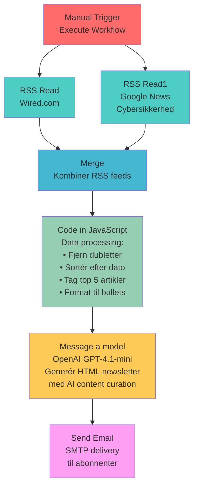

# 📧 Auto-Newsletter Support Solutions

## Overblik

Dette n8n workflow automatiserer oprettelsen og afsendelsen af ugentlige nyhedsbreve for Support Solutions. Systemet samler teknologi-nyheder fra forskellige RSS-kilder, kurerer indholdet intelligent via AI, og sender professionelle HTML-emails til abonnenter.

## 🎯 Formål

Workflowet er designet til at:
- Automatisere indholdsindsamling fra relevante teknologi-nyhedskilder
- Kurere og filtrere nyheder for at fokusere på cybersikkerhed og cloud-teknologi
- Generere professionelle nyhedsbreve med Support Solutions branding
- Sende personaliserede emails til målgruppen

## 📊 Workflow Diagram

### n8n Workflow Screenshot

*Det faktiske n8n workflow interface viser den lineære proces fra RSS feeds til email delivery.*

### Detaljeret Flow Diagram

## 🔧 Teknologier og Komponenter

### 1. **Manual Trigger**
- **Formål**: Starter workflow manuelt
- **Hvorfor**: Giver kontrol over hvornår nyhedsbrevet skal genereres og sendes

### 2. **RSS Feed Readers** 
#### RSS Read (Wired.com)
- **URL**: `https://www.wired.com/feed/rss`
- **Formål**: Henter internationale teknologi-nyheder fra Wired
- **Hvorfor**: Wired er en autoritativ kilde for teknologi trends og cybersikkerhed

#### RSS Read1 (Google News)
- **URL**: `https://news.google.com/rss/search?q=(cybersikkerhed%20OR%20"cloud%20sikkerhed")&hl=da&gl=DK&ceid=DK:da`
- **Formål**: Henter danske nyheder om cybersikkerhed og cloud-sikkerhed
- **Hvorfor**: Lokaliseret indhold på dansk, specifikt rettet mod Support Solutions' fokusområder

### 3. **Merge Node**
- **Formål**: Kombinerer data fra begge RSS-kilder
- **Hvorfor**: Centraliserer data for videre bearbejdning

### 4. **JavaScript Code Node**
- **Formål**: Intelligent databehandling
- **Funktionalitet**:
  - Fjerner dubletter baseret på link/GUID
  - Sorterer artikler efter publikationsdato (nyeste først)
  - Udvælger de 5 mest relevante artikler
  - Formaterer data til struktureret output
  - Tilføjer metadata (kilde, dato, uddrag)

### 5. **OpenAI GPT-4.1-mini**
- **Model**: GPT-4.1-mini
- **Formål**: AI-drevet content curation og HTML generering
- **Funktionalitet**:
  - Intelligent udvælgelse af artikler (2 fra Wired, 1 fra Google News)
  - Generering af professionel intro-tekst
  - Formatering til Support Solutions' HTML-skabelon
  - Opretholdelse af brand guidelines og tone of voice

### 6. **Email Send (SMTP)**
- **Formål**: Levering af nyhedsbrev
- **Konfiguration**: 
  - Fra: Support Solutions <hidesh@live.dk>
  - Emne: Dynamisk med dato
  - Format: HTML med embedded styling

## 🎨 Design Principper

### Brand Guidelines
- **Primær farve**: #16346F (Mørkeblå)
- **Sekundær farve**: #FF9C00 (Orange)
- **Baggrund**: #FFFFFF (Hvid)
- **Typografi**: Arial, sans-serif

### Content Strategi
- **Sprog**: Dansk
- **Tone**: Professionel men tilgængelig
- **Fokus**: B2B teknologi, cybersikkerhed, cloud-løsninger
- **Struktur**: Kort intro + 3 kuraterede artikler + LinkedIn CTA

## ⚙️ Konfiguration og Setup

### Forudsætninger
1. **n8n Platform**: Installeret og kørende
2. **OpenAI API**: Gyldig API nøgle
3. **SMTP Server**: Konfigureret email-levering
4. **RSS Kilder**: Aktive og tilgængelige feeds

### Credentials
- **OpenAI API**: Konfigureret som "OpenAi account"
- **SMTP**: Konfigureret som "SMTP account"

### Workflow Indstillinger
- **Execution Order**: v1
- **Status**: Inactive (manual trigger)
- **Template Setup**: Completed

## 🚀 Hvordan det Bruges

1. **Start Workflow**: Klik på "Execute workflow" i n8n interface
2. **Data Indsamling**: Systemet henter automatisk data fra RSS-kilder
3. **Processing**: JavaScript kode behandler og kurerer indholdet
4. **AI Generation**: OpenAI genererer det færdige HTML nyhedsbrev
5. **Email Delivery**: SMTP sender nyhedsbrevet til modtagere

## 📈 Fordele ved denne Løsning

- **Automatisering**: Reducerer manuel arbejde betydeligt
- **Konsistens**: Ensartet kvalitet og format i hvert nyhedsbrev
- **Skalerbarhed**: Let at tilføje flere RSS-kilder eller modtagere
- **AI-kurering**: Intelligent udvælgelse og formatering af indhold
- **Brand Alignment**: Automatisk opretholdelse af Support Solutions' brand

## 🔄 Mulige Udvidelser

- **Scheduling**: Tilføj cron trigger for automatisk ugentlig kørsel
- **Flere Kilder**: Udvid med flere teknologi-nyhedskilder
- **Personalisering**: Tilpas indhold baseret på modtager-segmenter
- **Analytics**: Tilføj tracking for email åbninger og clicks
- **A/B Testing**: Test forskellige emnelinjer og layouts

---
